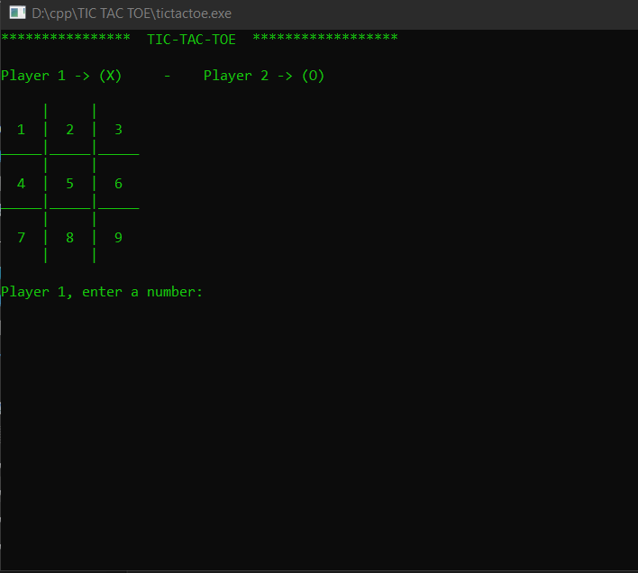

# TIC TAC TOE IN C

 Tic-tac-toe, noughts and crosses, or Xs and Os is a board game for two players who take turns marking the spaces in a three-by-three grid with X or O.   
 
 

## DESCRIPTION
 Tic Tac Toe is a classical board game which every person can relate playing since ages.
 The board is a 3x3 grid consisting of 3 rows and 3 columns.
 To to play game requires 2-Players (Xs represents Player-1) and (Os represents Player-2). 
 Goal: The player who succeeds in placing three of their marks in a horizontal, vertical, or diagonal row is the winner.

## QUICK-START
 Run the tictactoe.exe file to play the game.

## SOURCE-CODE BUILD (WINDOWS)
```console
$ gcc tictactoe.c -o tictactoe
```

## GAMEPLAY
```console 
 2-Player 
```

## HOW-TO-PLAY
|Symbol|description|
|---|---|
|<kbd>X</kbd>|Player 1 Symbol|
|<kbd>O</kbd>|Player 2 Symbol|

## REFERENCES
https://en.wikipedia.org/wiki/Tic-tac-toe